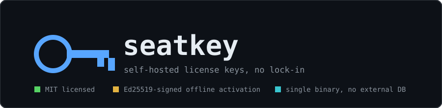
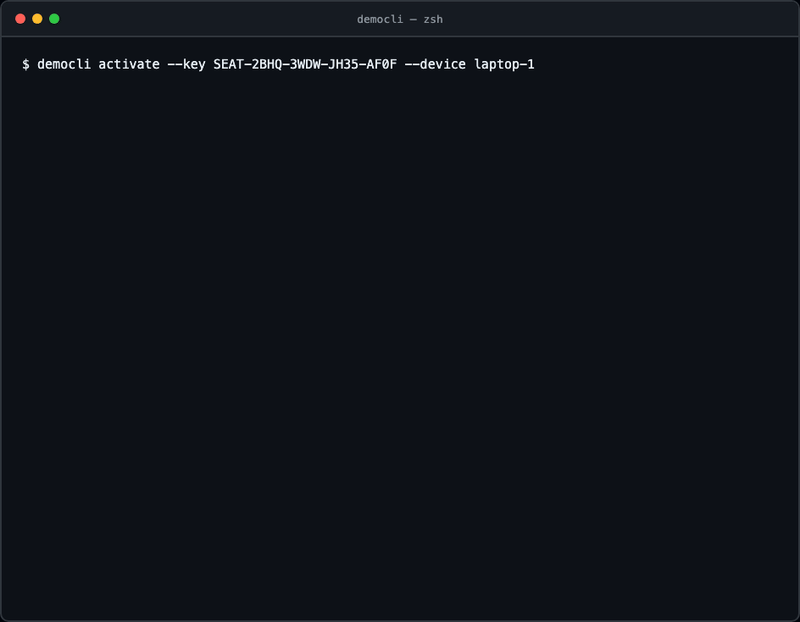
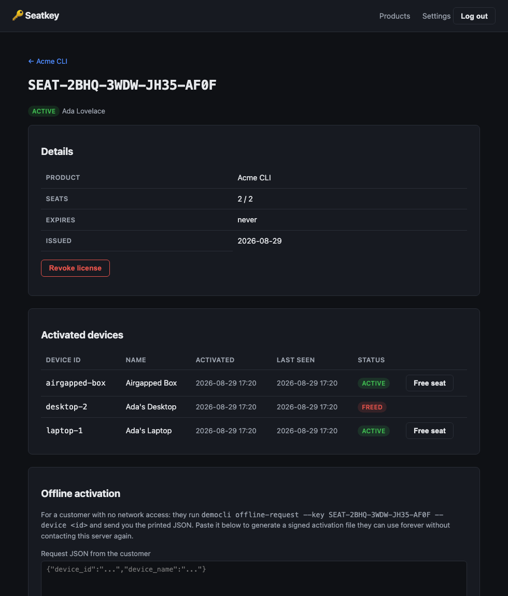

<div align="center">



**seatkey** — self-hosted license-key management for indie software, without the fair-code fine print.

Issue license keys, enforce per-license device limits, and support fully offline activation for
desktop apps and CLIs — as one static Go binary with an embedded database. No paid Enterprise
tier gates SSO or audit logs behind a second purchase, because there isn't one.

[](https://github.com/Laaaaksh/seatkey/stargazers)
[](#why-seatkey)

[](https://github.com/Laaaaksh/seatkey/actions/workflows/ci.yml)
[](https://github.com/Laaaaksh/seatkey/releases)
[](LICENSE)
[](go.mod)
[](#install)

**[Install](#install) • [Usage](#usage) • [Configuration](#configuration) • [Changelog](CHANGELOG.md) • [Contributing](CONTRIBUTING.md) • [License](LICENSE)**

**[Code of conduct](CODE_OF_CONDUCT.md) • [Security](SECURITY.md)**

</div>

## What it does

- Issue license keys per product and customer, each with a configurable device (seat) limit.
- Enforce that limit through a signed `/v1/activate` API an app calls at startup — a client caches
  the signed response and keeps working for a 7-day grace period with no further network call.
- Support **offline activation** for air-gapped machines: a customer generates a request file, you
  paste it into the dashboard, and the signed activation file it returns verifies forever with no
  further contact with this server.
- Manage products, licenses, and per-device activations from a clean self-hosted web dashboard —
  issue, revoke, and free seats.
- Fire an HMAC-signed webhook on every activation and deactivation, so you can wire up your own
  billing (Stripe, Paddle, whatever you already use) without Seatkey integrating with it directly.
- Run as a single static binary with an embedded SQLite database — no Postgres, no Redis, nothing
  else to run.

<p align="center">
  
</p>

The dashboard itself:

<p align="center">
  
</p>

## Why seatkey

[Keygen](https://keygen.sh)'s own server (`keygen-sh/keygen-api`) is licensed under the **Fair
Core License**, a source-available "fair-code" license that explicitly bans competing use — and
its Enterprise Edition features (SSO/SAML, audit logs, fine-grained permissions) require a
**paid** EE license key to unlock even when you're self-hosting. Cryptlex and LicenseSpring don't
offer a self-hostable tier at any price.

Seatkey is MIT-licensed, full stop. Every feature it has ships free, including the offline
activation flow that Keygen's free tier gates and the parts of licensing infrastructure other
tools charge extra for once you self-host. It's a narrower promise than "does more" — it's "the
same job, actually yours" — but if a non-compete clause or a second Enterprise invoice is what's
stopping you from self-hosting your license server, this is the alternative.

## Requirements

- To run it: nothing beyond a container runtime or a place to put one static binary. Seatkey
  embeds its own SQLite database — there is no external database to provision.
- To build it: Go 1.26+.

## Install

**Docker** (recommended):

```bash
docker run -d --name seatkey -p 8080:8080 -v seatkey-data:/data ghcr.io/laaaaksh/seatkey:latest
```

**From source:**

```bash
go install github.com/Laaaaksh/seatkey/cmd/seatkeyd@latest
go install github.com/Laaaaksh/seatkey/cmd/democli@latest   # optional: reference client, see Usage
```

Or download a prebuilt binary from [GitHub Releases](https://github.com/Laaaaksh/seatkey/releases).

## Usage

Start the server and open the dashboard:

```bash
seatkeyd                       # listens on :8080, stores data in ./seatkey.db
```

Visit `http://localhost:8080` — the first visit prompts you to set an admin password, since there
is no default credential to forget to change. From there: create a product, issue a license key
with a device limit, and you're ready to license an app against it.

A real app calls the API on startup. The included `democli` is a reference client that does
exactly this, useful for trying the whole flow without writing any code first:

```bash
democli activate --server http://localhost:8080 --key SEAT-XXXX-XXXX-XXXX-XXXX --device my-machine-id
democli run       # verifies the cached, signed license entirely offline
democli validate   # re-checks with the server and refreshes the cached grace period
democli deactivate # frees the seat
```

For an air-gapped customer, the flow is entirely offline after one manual exchange:

```bash
# On the air-gapped machine, no network required:
democli offline-request --key SEAT-XXXX-XXXX-XXXX-XXXX --device my-machine-id > request.json

# Send request.json to yourself; paste its contents into the license's
# "Offline activation" panel in the dashboard, which returns a signed activation file.

# Back on the air-gapped machine, again no network required:
democli offline-activate --file activation.json --pubkey <server-public-key-from-Settings>
democli run       # works forever with no further contact with the server
```

The HTTP API `democli` calls against is documented by its own source
(`cmd/democli/main.go`) and is intentionally small: `POST /v1/activate`, `POST /v1/validate`,
`POST /v1/deactivate`, and `GET /v1/pubkey`. Every signed response is a base64 JSON payload plus
an Ed25519 signature (`internal/crypto`) — verify it in any language with a standard Ed25519
implementation; a native SDK beyond this HTTP API is a possible future addition, not a v1 goal.

## Configuration

Seatkey is configured entirely through environment variables — there is no config file to manage:

| Variable                 | Default          | Purpose                                                    |
| ------------------------ | ---------------- | ----------------------------------------------------------- |
| `SEATKEY_DB_PATH`        | `seatkey.db`     | Path to the SQLite database file                            |
| `SEATKEY_ADDR`           | `:8080`          | Address the server listens on                                |
| `SEATKEY_COOKIE_SECURE`  | `false`          | Set `true` when serving TLS directly (not behind a plain-HTTP reverse proxy) |

The webhook URL/secret and the admin password are configured from the dashboard's Settings page,
not environment variables, since they're expected to change after initial setup.

## Changelog

See [CHANGELOG.md](CHANGELOG.md) for what changed in each release.

## Contributing

See [CONTRIBUTING.md](CONTRIBUTING.md) for the build/test workflow, code style, and release process.

## Security

See [SECURITY.md](SECURITY.md) for supported versions and how to privately report a vulnerability.

## Star this repo

If Seatkey saved you from either writing your own license server or paying for one, a star helps
other people looking for the same thing find it: [⭐ star seatkey](https://github.com/Laaaaksh/seatkey/stargazers).

## License

[MIT](LICENSE)
